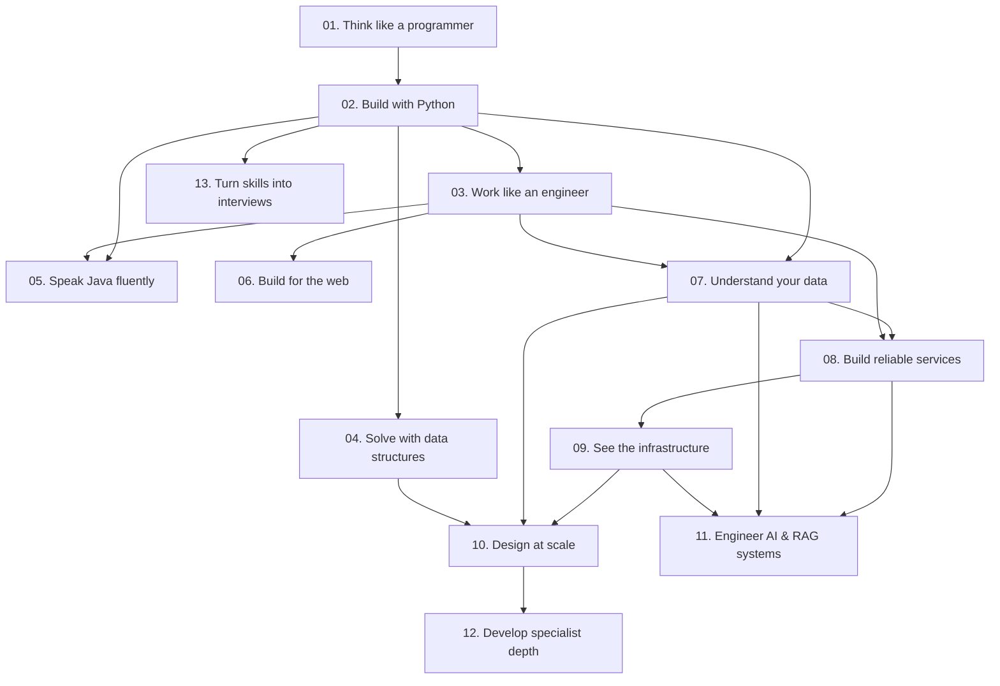

# Curriculum: beginner to specialist depth

A proposed 13-stage, 150-topic map. This is not a claim that all topics have lessons. Current coverage is 8 original starter exercises, three concept demos, four self-practice prompts, and 12 linked readings.

## Choose a route, not every branch at once

The initial route is foundations → Python → engineering tools → algorithms plus SQL → an API/project → infrastructure → interview evidence. Java is a target-role branch. Web engineering supports product-building roles. RAG builds on Python, data, backend, and systems fundamentals. Advanced specialist work is optional and open-ended, not a prerequisite for every entry-level job. Interview practice and applications run in parallel as relevant evidence develops.

Content status is intentionally separate from prerequisite readiness. A stage labelled “Starter lessons” covers a small part of the listed scope; “Concept demo” is not a full course. “Planned” defines future authoring work.

## Prerequisite graph

## 01. Think like a programmer

**Level:** Beginner. **Alpha coverage:** Starter lessons. **Prerequisites:** none.

**Outcome:** Predict a short program, explain each state change, and fix a boundary error.

### Topic sequence

1. Inputs and outputs
2. Values and types
3. Variables and assignment
4. Expressions
5. Boolean logic
6. Conditions
7. Loops
8. Trace tables
9. Debugging
10. Reading error messages

**Build:** A ticket calculator and sensor-alert counter.

**Independent gate:** Predict the exact state of a short unseen program; name the input and output; correct a boundary bug; explain assignment without claiming it is a live formula.

**Visual treatment proposal:** Source-line stepping, variable bindings, collection state, references at the appropriate depth, and output. The current mini runtime only implements bounded numeric/flat-list state.

## 02. Build with Python

**Level:** Beginner. **Alpha coverage:** Starter lessons. **Prerequisites:** Think like a programmer.

**Outcome:** Build a tested command-line application without copying a tutorial.

### Topic sequence

1. Lists and strings
2. Dictionaries and sets
3. Functions and scope
4. Mutability and references
5. Exceptions
6. Modules and packages
7. File I/O
8. Virtual environments
9. Type hints
10. Unit tests

**Build:** A searchable personal learning journal.

**Independent gate:** Write a small command-line program with functions and appropriate collections; handle expected errors; run unit tests; explain mutability and scope in real Python.

**Visual treatment proposal:** Source-line stepping, variable bindings, collection state, references at the appropriate depth, and output. The current mini runtime only implements bounded numeric/flat-list state.

## 03. Work like an engineer

**Level:** Beginner. **Alpha coverage:** Planned. **Prerequisites:** Build with Python.

**Outcome:** Reproduce a bug, write a failing test, fix it, and submit a clear pull request.

### Topic sequence

1. Terminal and filesystem
2. Git commits
3. Branches and pull requests
4. HTTP basics
5. JSON
6. Environment variables
7. Dependency management
8. Debuggers
9. Test design
10. Documentation

**Build:** A small open-source bug fix with a regression test.

**Independent gate:** Clone and run a project, produce a minimal failing test, make a focused commit, open a clear pull request, and explain the setup to another learner.

**Visual treatment proposal:** Visible requirements, artifacts, state changes, or review evidence rather than decorative animation.

## 04. Solve with data structures

**Level:** Intermediate. **Alpha coverage:** Starter lessons. **Prerequisites:** Build with Python.

**Outcome:** Solve unfamiliar variants, justify invariants, and explain time/space trade-offs.

### Topic sequence

1. Big-O and input size
2. Arrays and linked lists
3. Hash tables
4. Stacks and queues
5. Two pointers
6. Sliding windows
7. Binary search
8. Trees and heaps
9. Graphs and traversals
10. Recursion
11. Backtracking
12. Dynamic programming

**Build:** A route planner with tests and algorithm benchmarks.

**Independent gate:** Solve an unfamiliar variation, state an invariant, select revealing tests, and justify complexity. Recognizing a previously memorized title does not meet the gate.

**Visual treatment proposal:** Pointers, active windows, stack/queue contents, tree/graph frontiers, and dynamic-programming dependencies, each with a text-table equivalent.

## 05. Speak Java fluently

**Level:** Intermediate. **Alpha coverage:** Planned. **Prerequisites:** Build with Python; Work like an engineer.

**Outcome:** Implement the same concept in Python and Java and explain semantic differences.

### Topic sequence

1. JDK and compilation
2. Static types
3. Classes and interfaces
4. Composition and inheritance
5. Generics
6. Collections
7. Equality and hashing
8. Exceptions
9. Streams
10. JUnit
11. Concurrency basics
12. JVM memory and GC

**Build:** A tested Java inventory service.

**Independent gate:** Compile and test a Java program; justify data types; distinguish equality and identity; use collections safely; explain one trade-off against a Python version.

**Visual treatment proposal:** Compilation flow, types, stack frames, object identity, collection operations, and exception propagation; runtime-specific and versioned.

## 06. Build for the web

**Level:** Intermediate. **Alpha coverage:** Planned. **Prerequisites:** Work like an engineer.

**Outcome:** Ship a responsive, accessible application and explain browser/server boundaries.

### Topic sequence

1. Semantic HTML
2. CSS layout
3. JavaScript
4. TypeScript
5. DOM and events
6. Accessibility
7. React state
8. Next.js routing
9. Forms and validation
10. Browser networking
11. Frontend tests
12. Performance

**Build:** The learner dashboard for this platform.

**Independent gate:** Implement a responsive product brief with semantic HTML, tested forms, keyboard access, useful loading/errors, and an explained browser/server boundary.

**Visual treatment proposal:** Visible requirements, artifacts, state changes, or review evidence rather than decorative animation.

## 07. Understand your data

**Level:** Intermediate. **Alpha coverage:** Concept demo. **Prerequisites:** Build with Python; Work like an engineer.

**Outcome:** Design a schema, write correct SQL, and explain an index or transaction trade-off.

### Topic sequence

1. Relational modeling
2. Keys and constraints
3. SELECT and filtering
4. JOINs and NULL
5. Aggregation
6. Window functions
7. Indexes and query plans
8. Transactions
9. Isolation anomalies
10. Migrations
11. SQL injection prevention
12. Vector search foundations

**Build:** A learning-progress database with audited migrations.

**Independent gate:** Model keys and constraints; write joins and aggregation; explain NULL; read an actual plan; demonstrate a transaction or index trade-off on a named database version.

**Visual treatment proposal:** Tables, join matching, predicates, real query plans, index access paths, and transaction timelines. The shipped filtering demo is not a SQL engine.

## 08. Build reliable services

**Level:** Intermediate. **Alpha coverage:** Planned. **Prerequisites:** Understand your data; Work like an engineer.

**Outcome:** Build an API with authorization tests, understandable errors, and an operational runbook.

### Topic sequence

1. REST and contracts
2. Authentication vs authorization
3. Sessions and OAuth
4. Validation
5. Pagination
6. Idempotency
7. Caching
8. Background jobs
9. Rate limits
10. API testing
11. Structured logging
12. Threat modeling

**Build:** A job-application tracker API.

**Independent gate:** Deliver an API with validation, authorization denial tests, reproducible setup, meaningful errors, and a documented retry/idempotency policy.

**Visual treatment proposal:** Request paths, queues, service state, timelines, backpressure, and failure boundaries. Distinguish a toy assumption-driven model from measured behavior.

## 09. See the infrastructure

**Level:** Advanced. **Alpha coverage:** Concept demo. **Prerequisites:** Build reliable services.

**Outcome:** Follow a request across services and diagnose failures from evidence.

### Topic sequence

1. Processes and threads
2. Memory and filesystems
3. DNS
4. TCP and TLS
5. Reverse proxies
6. Load balancers
7. Containers
8. CI/CD
9. Cloud IAM
10. Monitoring and tracing
11. Queues and backpressure
12. Incident response

**Build:** A deployed service with load tests and a failure drill.

**Independent gate:** Trace a request through real components; explain DNS/TLS/processes; inspect logs and a metric; diagnose a controlled failure; keep secrets and user code isolated.

**Visual treatment proposal:** Request paths, queues, service state, timelines, backpressure, and failure boundaries. Distinguish a toy assumption-driven model from measured behavior.

## 10. Design at scale

**Level:** Advanced. **Alpha coverage:** Planned. **Prerequisites:** See the infrastructure; Understand your data; Solve with data structures.

**Outcome:** Defend a design under changing requirements and describe what breaks first.

### Topic sequence

1. Requirements and constraints
2. Capacity estimation
3. Data models
4. Replication
5. Partitioning
6. Consistency
7. Availability trade-offs
8. Retries and timeouts
9. Consensus intuition
10. Event-driven systems
11. Failure domains
12. Architecture decision records

**Build:** A document-processing platform with explicit consistency guarantees.

**Independent gate:** Clarify requirements, estimate capacity, defend a data model, identify failure domains, and revise a design when consistency or latency requirements change.

**Visual treatment proposal:** Request paths, queues, service state, timelines, backpressure, and failure boundaries. Distinguish a toy assumption-driven model from measured behavior.

## 11. Engineer AI & RAG systems

**Level:** Advanced. **Alpha coverage:** Concept demo. **Prerequisites:** Build reliable services; Understand your data; See the infrastructure.

**Outcome:** Build and evaluate a permission-aware retrieval system; explain retrieval failures separately from generation failures.

### Topic sequence

1. Tokens and embeddings
2. Keyword retrieval
3. Vector similarity
4. Chunking
5. Metadata filters and ACLs
6. Hybrid search
7. Reranking
8. Context construction
9. Citations
10. Retrieval evaluation
11. Groundedness and abstention
12. Prompt injection
13. Cost and latency
14. Freshness and deletion

**Build:** A source-cited tutor over an approved original lesson collection.

**Independent gate:** Compare against a lexical baseline; evaluate held-out queries; enforce source permissions; verify citations; demonstrate abstention and document deletion behavior.

**Visual treatment proposal:** Query → permitted candidates → retrieval scores → ranked evidence → context → cited answer, with evaluation failures inspectable at each step. The shipped demo stops at keyword evidence.

## 12. Develop specialist depth

**Level:** Expert practice. **Alpha coverage:** Planned. **Prerequisites:** Design at scale.

**Outcome:** Choose a specialty, read primary sources, reproduce an experiment, and defend a design review.

### Topic sequence

1. Advanced database internals
2. Compilers and interpreters
3. Distributed consensus
4. Concurrency correctness
5. Performance profiling
6. Security engineering
7. ML systems evaluation
8. Accessibility engineering
9. Technical leadership
10. Research replication

**Build:** Build a small database, interpreter, or retrieval benchmark.

**Independent gate:** Choose one specialty, study primary sources, reproduce a result, implement a substantial component, and defend the limitations in a design review.

**Visual treatment proposal:** Visible requirements, artifacts, state changes, or review evidence rather than decorative animation.

## 13. Turn skills into interviews

**Level:** Career. **Alpha coverage:** Self-practice studio. **Prerequisites:** Build with Python.

**Outcome:** Present reproducible work and communicate uncertainty, alternatives, and trade-offs.

### Topic sequence

1. Problem clarification
2. Think-aloud problem solving
3. Timed coding
4. Test selection
5. Complexity explanations
6. System design mocks
7. Behavioral evidence
8. Project walkthroughs
9. Resume evidence
10. Applications and networking
11. Interview reflection
12. Target-role gap analysis

**Build:** A portfolio case study and a recorded mock interview.

**Independent gate:** Clarify a new problem, communicate reasoning, write and test an answer, explain a real project, and reflect honestly on feedback. No job-outcome guarantee.

**Visual treatment proposal:** Visible requirements, artifacts, state changes, or review evidence rather than decorative animation.

## The eight shipped starter exercises

| Exercise | Concepts | Public fixtures | Explanation task |
|---|---|---|---|
| The running total | Loops & state | 4 | Explain why total starts at zero, what changes on each iteration, and the time and extra-space complexity. What happens with an empty list? |
| Price the tickets | Variables & expressions | 3 | What is the difference between a variable name, its value, and an expression? Why do we multiply price and quantity? |
| Count the alerts | Conditions & loops | 4 | Walk through the branch decisions. Distinguish counting matching elements from adding their values. Describe an important boundary test. |
| Find the highest reading | Loop invariants | 4 | Why is zero an unsafe initial maximum? State the input contract and explain what would need to change to allow empty lists. |
| Weight the scores | Indexing & parallel lists | 4 | How does the index connect two lists? What input validation would a production implementation require? |
| Find the even counts | Remainders & conditions | 4 | Explain what modulo measures and why zero qualifies as even. Show how your tests distinguish even from odd. |
| Keep every running total | Lists & transformations | 3 | How does a prefix sum differ from one final sum? Why is repeatedly concatenating lists less efficient than append in real Python? |
| Respect the capacity | If / else | 3 | Explain how the two branches cover the input cases. Which test exposes an off-by-one comparison mistake? |

All eight have original notes, a working reference example, a deliberate bug, input contracts, and public fixtures. Showing the reference is intentional for learning; passing its tests does not prove independent skill. Prefix-list construction explicitly discusses why repeated list concatenation has quadratic copying cost.

## Required lesson structure

Each future topic needs an original intuition, precise definition, prerequisite check, worked example, visual trace, counterexample, repair task, independent variation, project connection, explanation rubric, further-reading links, runtime version, and semantic tests. Advanced lessons add proof, measurement, failure analysis, or design review rather than only more terminology.

Content depth is reviewed separately from catalog breadth. The roadmap can grow without misrepresenting unfinished lessons as available. A learner may skip ahead with independent evidence, not simply by claiming a title.

## Source companions

- [Think Python, third edition](https://greenteapress.com/wp/think-python-3rd-edition/) — Allen B. Downey. Read for progressive explanations and small experiments. Link-only here; the listed license restricts commercial reuse.
- [The Python Tutorial](https://docs.python.org/3/tutorial/) — Python documentation. The language reference companion: data structures, control flow, functions, modules, and errors.
- [dev.java learning materials](https://dev.java/learn/) — Oracle / Java developer portal. Use the modern language and tooling documentation alongside a tested Java project.
- [Operating Systems: Three Easy Pieces](https://pages.cs.wisc.edu/~remzi/OSTEP/) — Remzi and Andrea Arpaci-Dusseau. Read around virtualization, concurrency, and persistence. Free access is not blanket republishing permission.
- [OpenDSA](https://opendsa-server.cs.vt.edu/) — OpenDSA / Virginia Tech. Compare an algorithm explanation with its interactive exercise. No third-party exercises are copied into this app.
- [Composing Programs](https://composingprograms.com/) — John DeNero. Abstraction, program structure, and reasoning. Edition-specific licensing needs review before any adaptation.
- [PostgreSQL Tutorial](https://www.postgresql.org/docs/current/tutorial.html) — PostgreSQL documentation. Pair SQL syntax with constraints, transactions, and query-plan experiments.
- [CS50x](https://cs50.harvard.edu/x/) — Harvard CS50. A broader conceptual companion. Complete your own work; do not transplant course solutions.
- [Retrieval Augmented Generation](https://www.deeplearning.ai/courses/retrieval-augmented-generation) — DeepLearning.AI. Extend retrieval intuition into an evaluated system. This catalog links to the course; it does not include paid content.
- [Three.js manual](https://threejs.org/manual/) — Three.js contributors. Scene graphs, rendering, and performance for concept-driven 3D labs.
- [Anime.js documentation](https://animejs.com/documentation/) — Anime.js contributors. Use motion to indicate a meaningful state change. Reduced-motion mode must retain the explanation.
- [Software Carpentry lessons](https://swcarpentry.github.io/python-novice-images/license/) — The Carpentries. A useful example of explicit lesson and code licensing. Preserve attribution and review individual assets.

The sources are reading companions and editorial references. This document is an original curriculum proposal, not a reproduction of their chapter text or an assertion that every linked work was read cover to cover.
